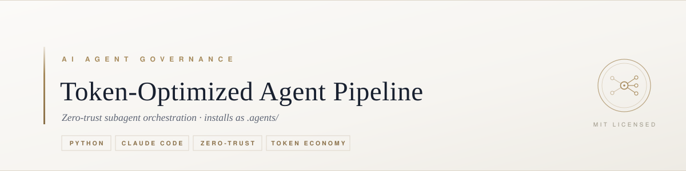

<a name="readme-top"></a>

<div align="center">

<!-- BANNER_START -->

<!-- BANNER_END -->

[![Release][version-shield]][version-url] [![License][license-shield]][license-url] [![Stars][stars-shield]][stars-url] [![Issues][issues-shield]][issues-url] [![Python][python-shield]][python-url]

<h3>Token-Optimized Agent Pipeline</h3>

<p>
A hierarchical, zero-trust subagent architecture for context-aware and token-efficient AI software engineering.
<br />
It prevents context bloat, secures RCE environments, and disciplines AI agent swarms into a zero-trust hierarchy — applying the same governance rigor to itself as to every host it audits.
</p>

<a href="agents.md"><strong>Read the governance ruleset »</strong></a>

<a href="https://github.com/GstMirabal/Token-Optimized-Agent-Pipeline/issues/new?template=bug_report.yml">Report Bug</a> · <a href="https://github.com/GstMirabal/Token-Optimized-Agent-Pipeline/issues/new?template=feature_request.yml">Request Feature</a> · <a href="CONTRIBUTING.md">Contribute</a>

</div>

<!-- TABLE OF CONTENTS -->
<details>
  <summary>Table of Contents</summary>
  <ol>
    <li>
      <a href="#about-the-project">About The Project</a>
      <ul>
        <li><a href="#at-a-glance">At a Glance</a></li>
        <li><a href="#built-with">Built With</a></li>
      </ul>
    </li>
    <li>
      <a href="#getting-started">Getting Started</a>
      <ul>
        <li><a href="#prerequisites">Prerequisites</a></li>
        <li><a href="#installation--configuration">Installation &amp; Configuration</a></li>
      </ul>
    </li>
    <li><a href="#usage">Usage</a></li>
    <li><a href="#contributing">Contributing</a></li>
    <li><a href="#license">License</a></li>
    <li><a href="#contact">Contact</a></li>
  </ol>
</details>

## About The Project

The Token-Optimized Agent Pipeline is an AI agent governance framework designed to prevent context bloat, secure RCE environments, and ensure long-term knowledge retention. It turns general-purpose AI agents into a coordinated pipeline of specialized subagents.

**Key Features:**
*   **Zero-Trust Identity Hierarchy:** Segregated Principal, Orchestrator, QA Agent, Tester Agent, and Skill Architect roles to prevent autonomous logic failures.
*   **Double-Gate Execution Pipeline:** A strict Double-Gate Review protocol ensuring structural and functional verification before user handoffs.
*   **100% Coverage Mandate:** Strategic requirement enforced by the **Tester Agent**, ensuring zero-defect integration before any code commitment.
*   **Token-Saver Auditor:** An automated safeguard that prevents inefficient plans and reduces API costs by optimizing context windows.
*   **Omni-Context Minimizer:** Smart AST-based code skeleton extraction that allows AI to understand massive files (1000+ lines) while only consuming 10% of the normal token cost.
*   **Skill Forge & Flat Skill Mapping:** Universal, deterministic tooling governed by the Three-File Skill Standard and external nomenclature (`-3rd`), bridged to real Claude Code slash commands via `scripts/install_claude.sh` + the `slash-commander` skill.
*   **Knowledge Extraction & Memory:** Automatic heuristic distillation via `extract_workflow.md`, indexing lessons into atomic Knowledge Items (KIs) inside `/memory/`.
*   **Persistent Compliance Roadmap:** Integrated topology via `docs/roadmaps/`, anchored by the unbreakable `docs/active_state.json`.
*   **Documentation Standard:** Deterministic freshness-gate (Diátaxis + C4 + ADR) that keeps architecture docs from silently going stale — enforced at sprint close, not by agent memory.

### At a Glance

| | |
| :--- | :--- |
| **Governance** | Keyed ruleset in [`agents.md`](agents.md) + 10 lazy-loaded domain rule contexts in [`rules/`](rules/) |
| **Subagents** | 13 role-segregated agents in [`agents/`](agents/) — 8 core pipeline roles, 5 auxiliary |
| **Skills** | 34 flat skills in [`skills/`](skills/), routed statically via `manifest_skills.json` |
| **Workflows** | 12 protocols in [`workflows/`](workflows/), exposed as 13 `/agents:*` slash commands |
| **Pipeline** | 8 phases (Planning → Sprint Closeout), gated by a single attended human authorization |
| **Integration** | Git submodule + idempotent Claude Code bridge; never writes outside `.claude/` and `CLAUDE.md` |

### Built With

     

<p align="right">(<a href="#readme-top">back to top</a>)</p>

## Getting Started

### Prerequisites

*   **Git**: Required for submodule management and architectural inheritance.
*   **Python 3.10+**: Required for the Omni-Minimizer, hooks, and governance scripts (stdlib only — no runtime dependencies). CI runs 3.12.
*   **pnpm 11+** *(optional)*: Only for hosts managing JS/TS skills. `npm`/`yarn` are prohibited for installation, and `ignore-scripts=true` + `minimum-release-age=1440` are mandatory (`agents.md §8`, `RA-10`).

### Installation & Configuration

1. **Add the framework as a submodule**
   To use it in a project, add it to your repository root:
   ```bash
   git submodule add https://github.com/GstMirabal/Token-Optimized-Agent-Pipeline .agents
   ```

2. **Install the Claude Code bridge**
   Claude Code only auto-discovers agents/commands/skills/hooks from `.claude/` and `.mcp.json` at your **project root** — it never reads inside a submodule. Run the installer once (idempotent, safe to re-run):
   ```bash
   .agents/scripts/install_claude.sh
   ```
   This symlinks `.agents/agents/*.md` → `.claude/agents/`, `.agents/commands/*.md` → `.claude/commands/agents/` (exposed as `/agents:*`), `.agents/skills/*/` → `.claude/skills/`, merges hooks + MCP servers into your `.claude/settings.json` / `.mcp.json`, and adds the `@.agents/agents.md` import to your `CLAUDE.md` so the governance rules auto-load every session. It never overwrites non-symlinked host content.

   **Project profiles (opt-in)**: project-family packs (extra rules, specialist agents, domain skills) live under `profiles/` and are only linked when explicitly requested:
   ```bash
   .agents/scripts/install_claude.sh --profile example-project
   ```
   > [!NOTE]
   > Real production profiles are never committed to this public repo (`RA-15`) — they live in a private location the host controls. `profiles/example-project/` is illustrative only.

3. **Pin a release (recommended) or track main**
   Pin the submodule to a tagged release for reproducible governance — updates then happen deliberately, not by drift (same supply-chain reasoning as `RA-10`):
   ```bash
   cd .agents && git fetch --tags && git checkout v4.2.1 && cd ..
   git add .agents && git commit -m "chore(deps): pin .agents to v4.2.1 #[Sprint_ID]"
   ```
   Every tag is published as a [GitHub Release](https://github.com/GstMirabal/Token-Optimized-Agent-Pipeline/releases) with its notes, so you can read exactly what a version changes before pinning to it.

   To upgrade later: check the [CHANGELOG](CHANGELOG.md), check out the new tag, and re-run the installer to pick up new agents/commands/skills:
   ```bash
   git submodule update --remote --merge   # only if you deliberately track main
   .agents/scripts/install_claude.sh
   ```

4. **Audit & configure**
   Review [`agents.md`](agents.md) — the governance ruleset the installer auto-imports into your `CLAUDE.md` — to confirm your local paths and environment map correctly onto the framework. Your own `docs/0_SYSTEM_OVERVIEW.md` entry point is scaffolded into the host on the first `/agents:pipeline` run (`workflows/standardization_workflow.md`), so there is nothing to write by hand.

<p align="right">(<a href="#readme-top">back to top</a>)</p>

## Usage

Once integrated, the framework automatically triggers its auditors during your AI coding sessions. For example, if you ask the AI to analyze a large module, the **Token-Saver** will mandate the use of the minimizer:

```bash
# Example: Extracting the skeleton of a large class to save tokens
python .agents/skills/omni-context-minimizer/scripts/omni_minimizer.py path/to/large_file.py
```

### 🤖 Core Commands (Slash Commands)

The framework maps every `workflows/*.md` protocol to a real Claude Code slash command in `commands/*.md`, installed under the `/agents:*` namespace so they never collide with commands your host project defines. The three you will use every session:

| Command | Purpose |
| :--- | :--- |
| **`/agents:start`** | **Entry Gate**: Initializes Zero-Memory, installs the Claude bridge on first run, syncs the DevOps/Git Sync agents, and prepares execution limits. |
| **`/agents:pipeline`** | **Orchestration**: The Double-Gate execution pipeline. Distributes tasks across subagents. |
| **`/agents:close`** | **Exit Gate**: Extracts heuristics, updates roadmaps, mirrors state, and seals the repo securely. |

Two more earn their place on a repository the framework has not seen before:

| Command | Purpose |
| :--- | :--- |
| **`/agents:harden`** | Turns on the platform controls a public repository should have — secret scanning, private vulnerability reporting, Dependabot, code scanning, branch protection — in an order that does not lock you out of your own work. |
| **`/agents:revdoc`** | Produces documentation for an existing codebase that is true, and provably so: graph first, every declared path verified, contracts written for every exposed interface. |

See the full command reference → [`docs/guides/AGENTS_SLASH_COMMANDS_GUIDE.md`](docs/guides/AGENTS_SLASH_COMMANDS_GUIDE.md) (all 13 commands, the Skills Manifest JSON example, and the full retrofit scenario walkthrough).

### 🛡️ Scenario: Retrofitting Existing Projects

If you are adding the framework to an **already established repository**, follow this sequence to align your architectural roadmap:

1.  **Submodule insertion:** In your root folder: `git submodule add https://github.com/GstMirabal/Token-Optimized-Agent-Pipeline .agents`
2.  **Bridge installation:** `.agents/scripts/install_claude.sh` (creates `.claude/agents`, `.claude/commands/agents`, `.claude/skills`, and merges hooks/MCP config).
3.  **AI session trigger:** Tell the AI: *"Initialize session using governance protocols in `.agents/` and execute `/agents:start`."*
4.  **Roadmap discovery:** The topology mapper will map `docs/active_state.json` (scaffolding it on first run — see `start_workflow.md`).
5.  **Then follow the canonical onboarding order**, defined once in [`agents.md §6`](agents.md) and deliberately not restated here: **`/agents:harden`** (platform controls, changes no code) → **`/agents:standardization`** (artifacts and topology) → **`/agents:revdoc`** (documentation of the code, verified against the graph) → **`/agents:pipeline`** (change).

The Orchestrator will scan your source code, identify your project's current Phase, initialize your local context, and generate persistent architectural tracking in `docs/roadmaps/`.

> [!TIP]
> **Documentation sovereignty:** All technical docs, implementation plans (`docs/sprints/`), and local roadmaps (`docs/roadmaps/`) are bound directly to Pipeline tracking under `/docs/`.

> [!IMPORTANT]
> **Orchestration manifest:** The Orchestrator uses `.agents/skills/manifest_skills.json` to statically route tools, drastically reducing token consumption and discovery time during sessions — see the guide above for a worked example.

Check [`workflows/`](workflows/) for automated protocols like project scaffolding, and [`mcp_servers/`](mcp_servers/) for bridging external LLM data nodes.

<p align="right">(<a href="#readme-top">back to top</a>)</p>

## Contributing

Contributions to the core framework are **greatly appreciated**. Start with [`CONTRIBUTING.md`](CONTRIBUTING.md) — it covers the real flow used here (branch discipline under `RA-12`, forging a skill via `skill-creator`, and what never belongs in a PR to this repo). Participation is governed by the [Code of Conduct](CODE_OF_CONDUCT.md); to report a vulnerability, follow [`SECURITY.md`](SECURITY.md) instead of opening a public issue.

1. Fork the project
2. Create your branch (`git checkout -b feature/AmazingFeature`)
3. Commit your changes using Conventional Commits (`git commit -m 'feat: add some amazing feature'`)
4. Push to the branch (`git push origin feature/AmazingFeature`)
5. Open a Pull Request

### 🧬 Developing the Framework Itself (Nucleus Mode)

Working *inside* this repo (not a host project) is a different case: the full host bridge is refused (`agents.md §5 nucleus_neutrality` — this repo is the ruleset, not a project it governs), so `/agents:*` commands don't exist here until you run the installer's **minimal self-bridge**:

```bash
git clone https://github.com/GstMirabal/Token-Optimized-Agent-Pipeline.git
cd Token-Optimized-Agent-Pipeline
python3 scripts/install_claude.py
```

This links `.claude/commands/agents/*` and `.claude/agents/*` (so `/agents:start`, `/agents:close`, etc. work while you develop) and adds `@agents.md` to a nucleus-local `CLAUDE.md` — no hooks, skills, MCP, or scaffolding (those assume a host root; `.claude/` here is git-ignored, regenerate anytime by re-running the script). **Restart your Claude Code session** afterward — commands are discovered at session start, not live.

<p align="right">(<a href="#readme-top">back to top</a>)</p>

## License

Distributed under the MIT License — see [`LICENSE.txt`](LICENSE.txt). A handful of vendored skills carry their own license instead; those are disclosed in [`NOTICE.md`](NOTICE.md), and skills whose provenance is still unverified are tracked in [`docs/audits/THIRD_PARTY_PROVENANCE_TODO.md`](docs/audits/THIRD_PARTY_PROVENANCE_TODO.md).

<p align="right">(<a href="#readme-top">back to top</a>)</p>

## Contact

**Gustavo Mirabal Suarez** — Project Link: [github.com/GstMirabal/Token-Optimized-Agent-Pipeline](https://github.com/GstMirabal/Token-Optimized-Agent-Pipeline)

<a href="https://www.linkedin.com/in/gstmirabal/"></a> <a href="mailto:gst.mirabal@gmail.com"></a> <a href="https://x.com/gst_mirabal"></a>

<p align="right">(<a href="#readme-top">back to top</a>)</p>

<!-- MARKDOWN LINKS & IMAGES -->
[version-shield]: https://img.shields.io/github/v/release/GstMirabal/Token-Optimized-Agent-Pipeline?style=flat&label=release&color=a68a5b&labelColor=18202f
[version-url]: https://github.com/GstMirabal/Token-Optimized-Agent-Pipeline/releases/latest
[license-shield]: https://img.shields.io/github/license/GstMirabal/Token-Optimized-Agent-Pipeline?style=flat&color=a68a5b&labelColor=18202f
[license-url]: https://github.com/GstMirabal/Token-Optimized-Agent-Pipeline/blob/main/LICENSE.txt
[stars-shield]: https://img.shields.io/github/stars/GstMirabal/Token-Optimized-Agent-Pipeline?style=flat&color=a68a5b&labelColor=18202f
[stars-url]: https://github.com/GstMirabal/Token-Optimized-Agent-Pipeline/stargazers
[issues-shield]: https://img.shields.io/github/issues/GstMirabal/Token-Optimized-Agent-Pipeline?style=flat&color=a68a5b&labelColor=18202f
[issues-url]: https://github.com/GstMirabal/Token-Optimized-Agent-Pipeline/issues
[python-shield]: https://img.shields.io/badge/Python-3.10%2B-a68a5b?style=flat&labelColor=18202f
[python-url]: https://www.python.org/downloads/
