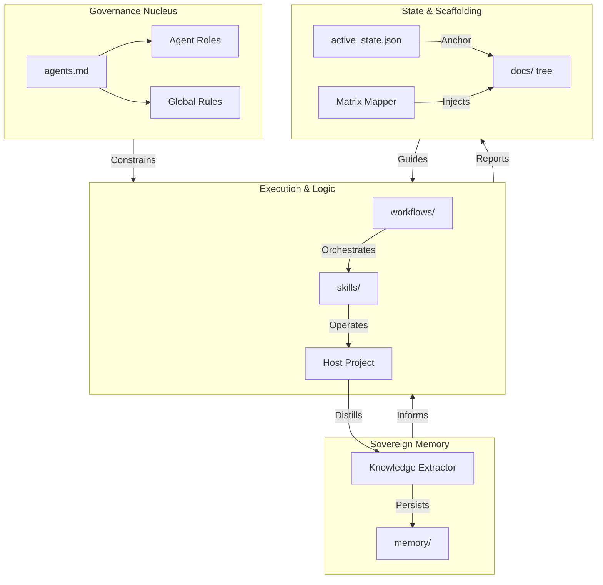

# 🌐 Global Framework Architecture (.agents)

This document provides a high-level visual representation of the Universal-Agents framework architecture and its internal interconnections.

## 1. Macro-Component Connectivity

The following diagram illustrates the flow of governance, intelligence, and execution within the Matrix.

## 2. Core Functional Layers

### 🏛️ Layer 1: Governance (The Constitution)
The Foundation of the Matrix. It defines the "Legal" boundaries of any operation. No subagent or workflow can bypass the rules defined in `agents.md`.

### ⚓ Layer 2: Scaffolding & State (The Anchor)
The Operational Truth. Controlled by the **Matrix Mapper**, this layer ensures that every session has a clear point of origin and a standardized geography through the `/docs/` tree.

### ⚡ Layer 3: Orchestration (The Brains)
The Tactical Logic. Controlled by the **Orchestrator** and **Doc Orchestrator**, this layer translates strategic roadmaps into actionable tasks and hardened documentation.

### 🛠️ Layer 4: Execution (The Arsenal)
The Physical Impact. Highly specialized **Skills** (local and 3rd party) perform the actual code manipulation and quality audits under the command of Layer 3.

## 3. Communication Bridge
Inter-agent communication is managed through **Contracts** located in `docs/contracts/`. These files define the technical interfaces and I/O expectations for every functional handoff.
